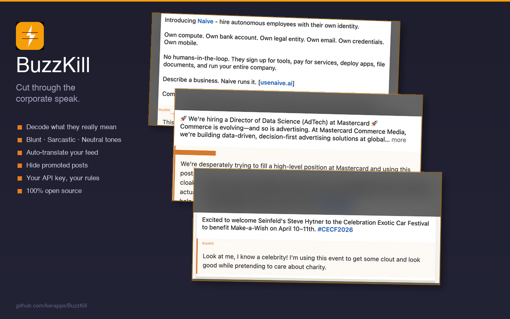

# LinkedOut — LinkedIn Corporate Speak Translator

<p align="center">
  
</p>

A Chrome extension that translates LinkedIn corporate speak into plain language — and can rewrite your plain text into LinkedIn-style corporate tone.

Inspired by [Kagi Translate's LinkedIn Speak](https://translate.kagi.com/?from=en&to=LinkedIn+speak), but in reverse for feed clarity.

<!-- Uncomment after Chrome Web Store approval:
[](https://chrome.google.com/webstore/detail/EXTENSION_ID)
-->
[](LICENSE)

## Features

- Translate post text into plain language (blunt, sarcastic, or neutral tone)
- Auto-translate feed mode
- Hide original post text option
- Hide promoted / sponsored posts (enabled by default)
- Keep @mentions and links — optionally preserve clickable person tags and URLs in translations
- In-page HUD with quick settings and usage stats
- "Create a post" mode — convert plain text into LinkedIn corporate speak
- Token usage tracking with estimated cost
- Translation cache to reduce repeated API spend

## Install

### From Chrome Web Store (recommended)

<!-- Replace with actual link after approval -->
_Coming soon — pending Chrome Web Store review._

### From Source (Developer Mode)

1. Clone or download this repository
2. Open `chrome://extensions/`
3. Enable **Developer mode** (top-right toggle)
4. Click **Load unpacked**
5. Select the project folder

### Sideload the ZIP (no build required)

If you prefer not to install from the Chrome Web Store, you can sideload the pre-packaged extension:

1. Download the latest `linkedout.zip` from [Releases](https://github.com/kerapps/LinkedOut/releases), or build it yourself:
   ```bash
   git clone https://github.com/kerapps/LinkedOut.git
   cd LinkedOut
   ./package.sh
   ```
2. Unzip `linkedout.zip` into a folder (e.g. `~/linkedout-ext/`)
3. Open `chrome://extensions/`
4. Enable **Developer mode** (top-right toggle)
5. Click **Load unpacked**
6. Select the folder where you unzipped the files

The extension will stay active until you remove it. To update, repeat the process with a newer zip.

## Configuration

Open the extension popup or the in-page HUD to configure:

| Setting | Description |
|---|---|
| Provider | OpenAI or Anthropic |
| API Key | Your provider API key |
| Tone | Blunt / Sarcastic / Neutral |
| Auto-translate | Translate feed posts automatically |
| Hide original | Show only the translated version |
| Hide promoted | Remove promoted / sponsored posts |
| Keep @mentions and links | Preserve clickable person tags and URLs in translations |

You need your own API key from [OpenAI](https://platform.openai.com/api-keys) or [Anthropic](https://console.anthropic.com/settings/keys).

## Data & Privacy

LinkedOut takes privacy seriously:

- **No backend server** — the extension runs entirely in your browser.
- **Post text is sent only to the AI provider you selected** (OpenAI or Anthropic), using your own API key, solely for translation.
- **All requests go directly from your browser** over HTTPS. No intermediary.
- **Settings, cache, and stats are stored locally** in Chrome extension storage.
- **No personal data is collected, sold, or shared** for advertising or any other purpose.

Full privacy policy: [PRIVACY_POLICY.md](PRIVACY_POLICY.md)

## Project Structure

```
manifest.json        Extension manifest (Manifest V3)
background.js        Service worker — proxies API calls, rate limiting
translator.js        Translation logic, prompts, caching, stats
content.js           Content script — post detection, UI injection
content.css          Styles for injected UI elements
popup.html/js/css    Extension popup — settings, stats, "Create post"
icons/               Extension icons (16/48/128)
PRIVACY_POLICY.md    Privacy policy
LICENSE              MIT license
```

## Contributing

Issues and PRs are welcome at <https://github.com/kerapps/LinkedOut>.

## License

[MIT](LICENSE)
